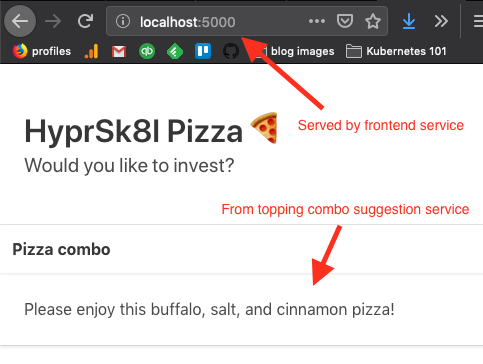
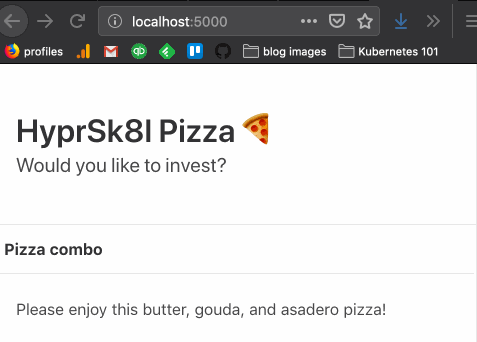

## What is this?

Welcome to Kubernetes 101! The goal of this workshop is to familiarize participants with Kubernetes just enough to get going. It is intended to educate application engineers whose companies have moved onto Kubernetes and assumes some familiarity with microservices and web programming. If you'd like to support the production of content like this, we do offer [in-person corporate training](https://ponderosa.io/corporate_training).

In this workshop we'll take on what's a pretty common operation these days: take an existing application and write configuration files so that we can run the application on Kubernetes. This is often what a team means when it says "we're moving our app onto Kubernetes." 

When moving an application onto Kubernetes, it's essential that you understand how the application should work (otherwise, how will you know if you broke it?). To that end, let's introduce HyperScale Pizza, which is moving to Kubernetes!

## Introducing HyperScale Pizza

Silicon Valley's latest darling is HyperScale Pizza. With rapid user growth, this pizza topping suggestion web app has not only revolutionized the pizza business, it has also lead to massive investment in other AI-powered topping suggestion apps: ice cream topping suggestions, taco topping suggestions...the list goes on.

The HyperScale pizza web app itself has a very simple interface, honed through intense user experience testing:

On every web request, you get a new pizza topping combo suggestion:

### The application's architecture

The application is composed of two services:

1. The **webapp service**, which takes web requests from users and renders a response in the browser after making a call to the **topping suggestion service** to retrieve a new pizza topping combination.
2. The **topping suggestion service**, which returns topping combination suggestions from the `topping_combo` endpoint.

Here's an admittedly crude service diagram:

### The GitHub repository

As a bleeding edge startup, HyperScale Pizza hosts itopping suggestion servicelication code in version control, and it's all open source. The [GitHub repository](https://github.com/ponderosa-io/kubernetes-101/) is laid out as follows:

* `/workshop` — contains Jekyll site guiding participants through the workshop (i.e. this page)
* `/webapp-service` — contains a Flask app that runs the webapp service
* `/topping-suggestion-service` — contains a Flask app that runs the topping suggestion service
* `/resources` — contains useful files invoked in the workshop
* `/k8s` — an empty directory that we suggest putting Kubernetes manifests in (this is just a suggestion and is not required by Kubernetes).

### How to run the applications

Both the webapp service and the topping suggestion service are [Flask](http://flask.pocoo.org/) apps — Flask is a dead simple Python web framework, which was chosen for its ease of use and intelligibility (as long as you know a programming language, I promise you can figure Flask out in less than 5 minutes).

To run either application, navigate to its directory and run `flask run -p 1234`, where `1234` is the port on `localhost` you want to serve the application on. Before doing this, you'll likely need to run `pip install -r requirements.txt`, which will install the application's requirements on your machine.

Note: the webapp service expects a `TOPPING_COMBO_SUGGESTION_SERVICE_URL` environment variable pointing to a working instance of the topping suggestion service. So if topping suggestion service is running on `localhost:2222`, you would want to run `TOPPING_COMBO_SUGGESTION_SERVICE_URL=http://localhost:2222 flask app`.

## Exercise

Run the entire HyperScale Pizza web application locally. This will entail starting two `flask` servers in both the `webapp-service` and `topping-suggestion-service` directories. Each directory's README contains instruction for running the service.

Feel free to skip this exercise if you do not want to see how the app runs locally. The rest of the workshop is geared towards putting the application on Kubernetes (i.e. running the application somewhere that's not on your computer), so not completing this exercise does not block that goal.